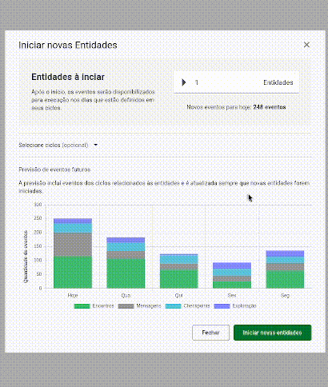

# CaseMeetime

Este projeto foi desenvolvido utilizando o framework _Angular_ (versão 19) e a biblioteca de componentes _Angular Material_. Recomenda-se utilizar a versão 22.15.0 (LTS) do Node.js para desenvolvimento.

## Execução

### Ambiente de desenvolvimento

Primeiramente é necessário instalar as dependências do projeto com o seguinte comando:

```bash
npm ci
```

Feito isso, podemos iniciar o servidor de desenvolvimento com o seguinte comando:

```bash
npm start
```

Assim que o servidor estiver em execução, abra seu navegador e acesse http://localhost:4200/. O aplicativo será recarregado automaticamente sempre que houver alguma modificação no código-fonte.

## Documentação técnica

### Bibliotecas

Para o projeto, foi utilizada a biblioteca _Chart.js_ para os gráficos devido à sua simplicidade, funcionalidade, capacidade de customização e integração com o Angular.

Também foi utilizado SCSS em vez de CSS puro por oferecer recursos avançados como variáveis, aninhamento de seletores e mixins, que facilitam a organização, reutilização e manutenção do código.

### Estrutura de pastas

- `/public` - Arquivos estáticos
- `/src` - Pasta raíz do código-fonte
- `/src/api` - Pasta raíz dos serviços e modelos.
- `/src/app/` - Configurações da aplicação (rotas, estilos, etc)
- `/src/app/components` - Componentes reutilizáveis
- `/src/app/pages` - Páginas da aplicação
- `/src/lib` - Extensões, utils, etc

## Demonstração


